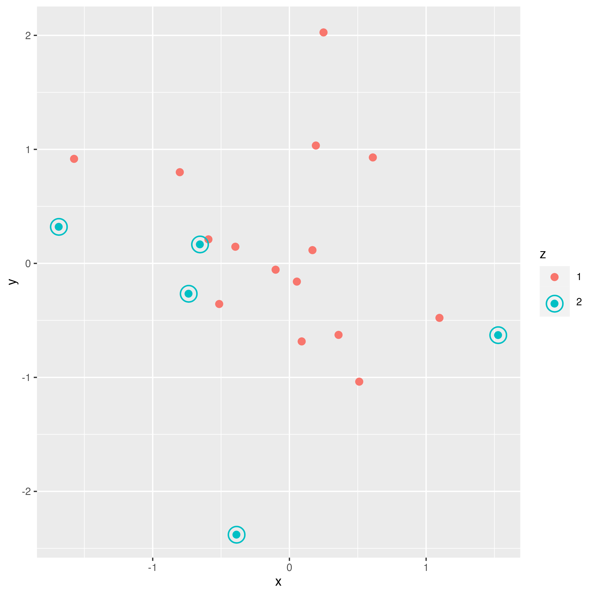

<div style="display: flex; justify-content: center;"></div>

# ggquartz

Add a target scale to your plots.
## Installation 

```R
remotes::install_github("quartzsoftwarellc/ggquartz")
```

## Usage

`scale_target()` adds an alternating shape scale of a filled circle and a target and a alternating size scale for the size of the circles and targets.

```R
library(magrittr)
library(ggplot2)
library(ggquartz)

data.frame(x = rnorm(20), y = rnorm(20), z= factor(c(rep(1, 15), rep(2, 5)))) %>%
   ggplot(aes(x = x, y = y, shape = z, size = z, color = z)) +
   scale_target() +
   geom_point()

ggsave("example.png")
```

