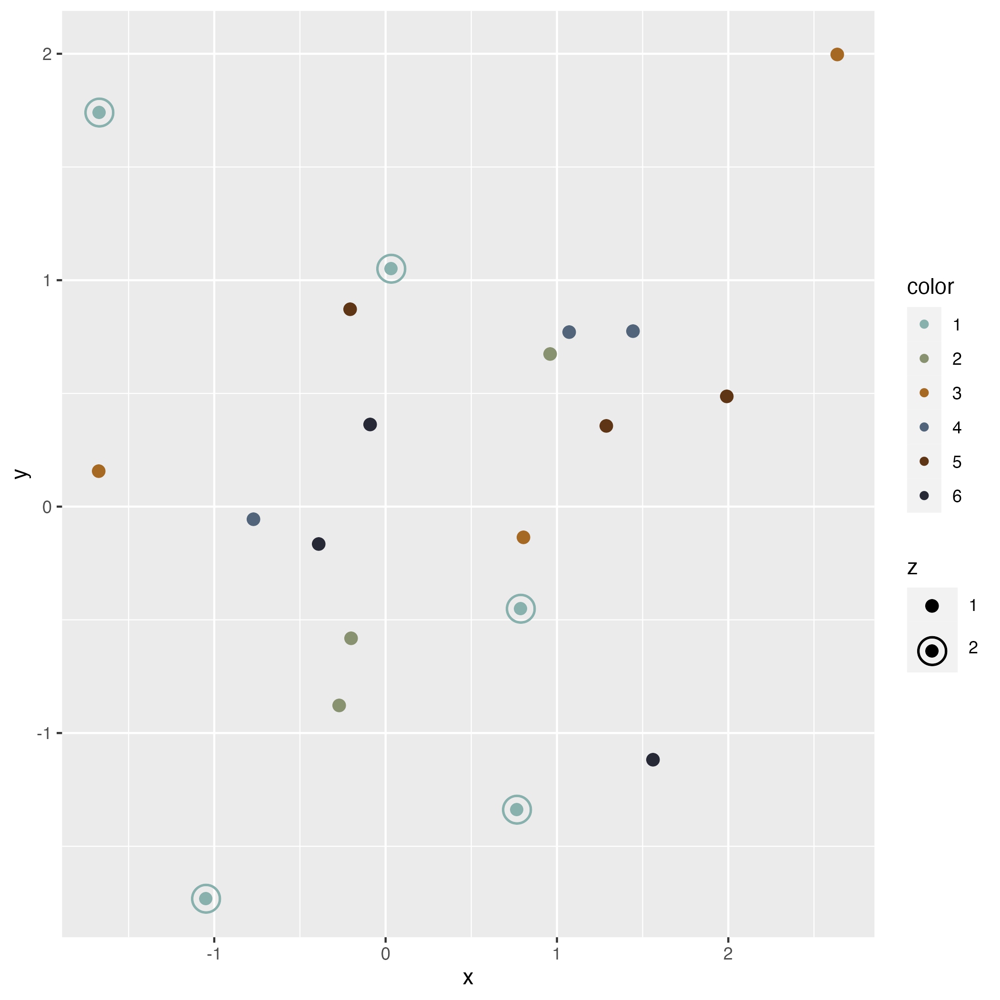

<div style="display: flex; justify-content: center;"></div>

# ggquartz
<!-- badges: start -->
[](https://github.com/QuartzSoftwareLLC/ggquartz/actions)
<!-- badges: end -->

Add a target scale to your plots.

## Installation 

```R
remotes::install_github("quartzsoftwarellc/ggquartz")
```

## Usage

`scale_target()` adds an alternating shape scale of a filled circle and a target and a alternating size scale for the size of the circles and targets. You can also use the `bluegill_palette` for added style.

```R
library(magrittr)
library(ggplot2)
library(ggquartz)

data.frame(x = rnorm(20), y = rnorm(20), color = factor(c(rep(2:6, 3), rep(1, 5))), z= factor(c(rep(1, 15), rep(2, 5)))) %>%
   ggplot(aes(x = x, y = y, shape = z, size = z, color = color)) +
   scale_target() +
   scale_color_manual(values = bluegill_palette) + 
   geom_point() -> p

ggsave("./example.png")
```

